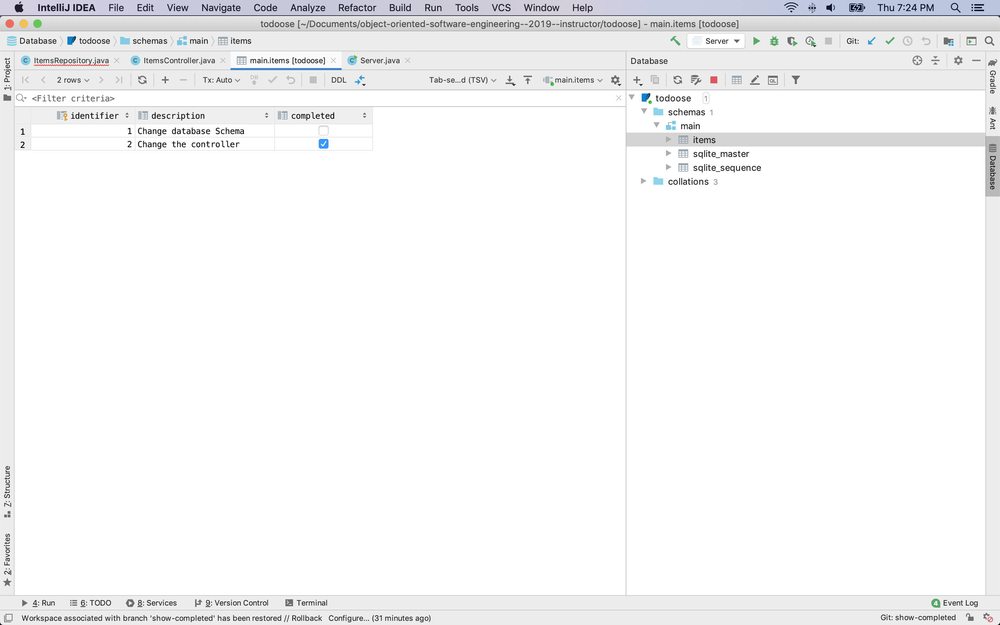
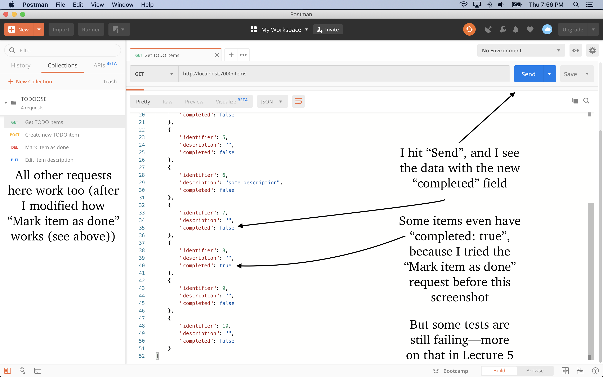

# Assignment 4: Implementation · Server

# Working on the Assignment

<video src="https://archive.org/download/jhu-oose/oose--assignments--4.mp4" controls preload="none"></video>

# Server

In [Lecture 4](/lectures/4) we started to implement a new feature in [TODOOSE](https://github.com/jhu-oose/todoose/): the ability to see items that were marked as completed, as opposed to just removing them from the list forever.

For this assignment you must complete the implementation of the server.

Watch the [video of the lecture](/lectures/4). Go through the [Issue](https://github.com/jhu-oose/todoose/issues/24), its corresponding [Pull Request](https://github.com/jhu-oose/todoose/pull/25), and the [project board](https://github.com/jhu-oose/todoose/projects/3) (look at Iteration 4). Go through the code base on the [`show-completed` branch](https://github.com/jhu-oose/todoose/tree/show-completed), which contains `TODO` comments you must fill in.

Here’s a video on how to work on TODOOSE and submit your assignment, now that we need to do more substantial changes to the code base:

<video src="https://archive.org/download/jhu-oose/oose--programming-assignment.mp4" controls preload="none"></video>

Here’s checklist of what you need to do:

- Check out the [`show-completed` branch](https://github.com/jhu-oose/todoose/tree/show-completed).

- Remove the `todoose.db` file if you have one. We changed the database schema to include a `completed` column in the `items` table, and deleting the database is our poor excuse for a data migration plan.

- [Rename the `update()` method in `ItemsRepository` to `updateDescription()`](https://github.com/jhu-oose/todoose/blob/46d406a0a4246f77a615e5ae939b4a6de25d2095/src/main/java/com/jhuoose/todoose/repositories/ItemsRepository.java#L65).

- Fix the compilation errors: [part 1](https://github.com/jhu-oose/todoose/blob/46d406a0a4246f77a615e5ae939b4a6de25d2095/src/main/java/com/jhuoose/todoose/repositories/ItemsRepository.java#L23) and [part 2](https://github.com/jhu-oose/todoose/blob/46d406a0a4246f77a615e5ae939b4a6de25d2095/src/main/java/com/jhuoose/todoose/repositories/ItemsRepository.java#L39).

- (Optional) Consider improving [the `if/then/else` situation on the controller](https://github.com/jhu-oose/todoose/blob/46d406a0a4246f77a615e5ae939b4a6de25d2095/src/main/java/com/jhuoose/todoose/controllers/ItemsController.java#L28-L29). Can you unify the methods `markAsCompleted()` and `update()` (which at this point you renamed to `updateDescription()`) in the `ItemsRepository`? The new unified method must update an `Item` regardless of what changed: either `description`, or `completed`, or both.

- Run the server, wait for it to start, then stop it. The `todoose.db` file you deleted above is back, and it has the new schema including the `completed` column on the `items` table.

- Open the database in IntelliJ like we did in lecture and add _real_ fake data for testing locally. Include a screenshot (see example below). For now, the client part of the application is broken because we changed how the server works, so looking at the database in IntelliJ is the only reliable way to see the data. We’ll fix this in [Lecture 5](/lectures/5) when we talk about the client.

  

- In Postman, if you still have the `TODOOSE` collection you imported in [Assignment 0](/assignments/0), delete it and import it again, because it changed.

- [Update the Postman request “Mark items as done” and its corresponding example](https://github.com/jhu-oose/todoose/blob/46d406a0a4246f77a615e5ae939b4a6de25d2095/src/main/java/com/jhuoose/todoose/Server.java#L27-L30).

- Add a new Postman request called “Mark items as incomplete” to the TODOOSE collection. It must include an example.

- You can run requests manually in Postman hitting by the `Send` button. The server must be doing the right thing, including marking items as completed and marking them as incomplete when using the new “Mark items as incomplete” request you just added. You can see the new data, including the `completed` field, _but the Postman tests still won’t pass_ (we need to fix the tests—that’s the subject of the [next lecture](/lectures/5)).

  

- Export the Postman collection and replace `docs/TODOOSE.postman_collection.json`.

- Commit and push **to your student repository** (see video above).

- Deploy this new version to Heroku. **Create a new Heroku application with an unpredictable name as explained in the video above; don’t reuse the Heroku application from [Assignment 0](/assignments/0).**


