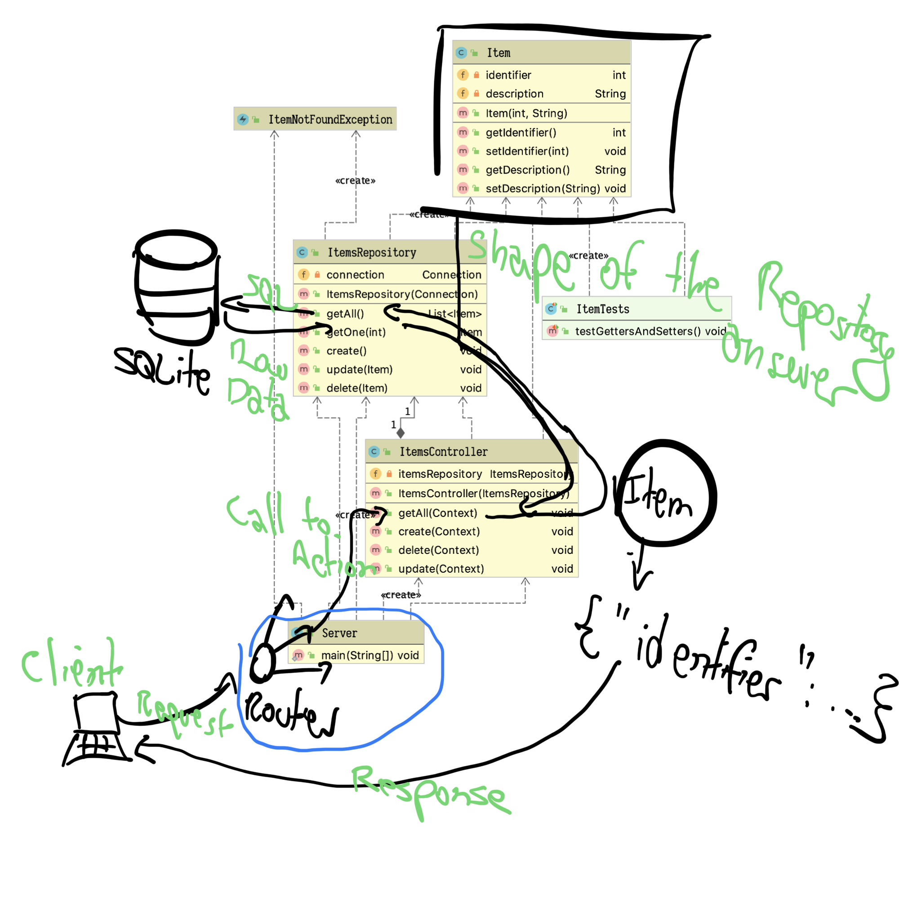

# Lecture 1: Design Rudiments

[**Video**](https://github.com/jhu-oose/2019-students/releases/download/lectures-videos/oose--lectures--1.mp4){:data-proofer-ignore="true"} <small title="You must be a registered student logged into GitHub to see this.">🔒</small>

# Now I’m Taking OOSE

```
This is a song called “Now I’m Taking OOSE”
Subtitle: “Procrastinating on Lecture Prep”

Woke up really early
In that cold November morning
Registration opened
And I was trying to get my seat
In OOSE
And I had to beat
What seemed
Like five thousand other people
And I did it
Sucks for them
And I went back to sleep

Now I’m reconsidering
Was this a good idea
’Cause instead of teaching Software Engineering
The guy is just playing his new guitar
As if I cared
’Cause I don’t
I guess I’ll just pretend to laugh
Ha ha ha
Ha ha

Now I’m taking OOSE
My best friend is Roboose
Working on a project I choose
That sucks less than TODOOSE

Now I’m taking OOSE

Half of it are labs
Group mate had garlic for lunch
I’m sorry buddy
But I don’t think that we can work under this condition
Go brush your teeth
And coming to think of it
Maybe not even then
’Cause you know,
Would it kill you to read the iteration page before to the lab?
Then we don’t have to explain everything to you…
Not nice, buddy
Ohhh, burn

Now I’m taking OOSE
My best friend is Roboose
Working on a project I choose
That sucks less than TODOOSE

Now I’m taking OOSE
My best friend is Roboose
Working on a project I choose
That sucks less than TODOOSE

Now I’m taking OOSE
Now I’m taking OOSE
Now I’m taking OOSE
Now I’m taking OOSE
```

# Class Diagrams

- Come up with features for TODOOSE
- Some of my ideas:
  - Users.
  - Different kinds of users, for example, project manager, software developer, and so forth.
  - Private and public lists.
  - Reordering items.
  - Nesting (indentation).
  - Multiple lists (move tasks between lists).
  - Notes & other item data.
  - Scheduling.
  - Synching with other providers (Apple Reminders, Google Keep, and so forth).
- Features we came up with in class:
  - Vim plugin.
  - Wallpaper.
  - Select multiple (maybe all) items as done at once.
  - See what’s complete.
  - Reordering.
  - Deadlines.
  - Subtasks.
  - Categories.
- Can we start writing code already?
  - Consider design.
    - When we talk about _design_ we mean design of the _code_, not _graphic design_.
    - And planning in general: writing pseudo-code, writing correctness proofs, and so forth.
    - _Unified Modeling Language_ (UML).
    - There are _many_ types of diagrams, we’ll only talk about Class Diagrams.
    - An UML diagrams of the different types of UML diagrams (so meta!) (from [Wikipedia](https://en.wikipedia.org/wiki/Class_diagram)):
      {:width="385"}
  - Yes:
    - _Emergent Design_.
    - Diagrams may merely document existing code.
    - That’s what happened with TODOOSE: we started with code, and now we can reflect on what we did and draw diagrams about it.
    - Diagrams are just a different perspective, and it may give you new insight.
  - No:
    - _Big Design Up Front_ (BDUF) or _Rough Design Up Front_ (RDUF).
    - Complex systems.
    - You’re architecting something for other people to build, for example, a plugin system (diagrams may be part of the documentation for plugin developers), or a network protocol (diagrams may help you communicate with browser developers), and so forth.
- Levels of abstraction:
  - Depends on your audience, and on what you want to communicate.
  - Some diagrams correspond one-to-one with code.
  - Some diagrams are open to interpretation and convey only high-level ideas.

# Architecture

- Low-level class diagram in IntelliJ for the whole `com.jhuoose.todoose` package:
  {:width="575"}
- Version annotated in class:
  
- Read diagram and code side-by-side:
  - Classes:
    - Fields.
    - Constructors (parameters).
    - Methods (parameters and return types).
    - Visibility.
  - Relationships:
    - Dependency (dashed arrow).
    - Annotations on edges, for example, «create».
    - Association (solid arrow).
    - Multiplicity (`3`, `1..2`, `*`, and so forth).
    - Whole-part diamond.
    - Most things about the syntax of the diagram are intentional, for example, the shape of the arrowhead, whether the diamond is filled in or not, and so forth.
    - See [Wikipedia](https://en.wikipedia.org/wiki/Class_diagram) article for more on syntax.
    - Common mistake: Relationships must be between two classes (except for inheritance, because the arrow makes the relationship clear).
- A lot of information: getters and setters, `identifier` field, extra arrows, and so forth.

# High-Level Class Diagrams

- The diagram we drew in class for extended TODOOSE features:
  
- Omit:
  - Classes like controllers, repositories, server, and so forth.
  - Getters and setters.
  - Obvious attributes, for example, identifier.
- Include:
  - Classes that are models.
- Sketch class diagram for some of the features we thought in the beginning of class.
  - Class diagrams must match the features, the wireframes, and everything else in the project proposal.
  - Nouns → Classes.
  - Verbs → Methods (or Classes, if they’re sufficiently complicated).
  - Inheritance.
- Common mistake:
  - Abuse inheritance (“is-a” relationship).
